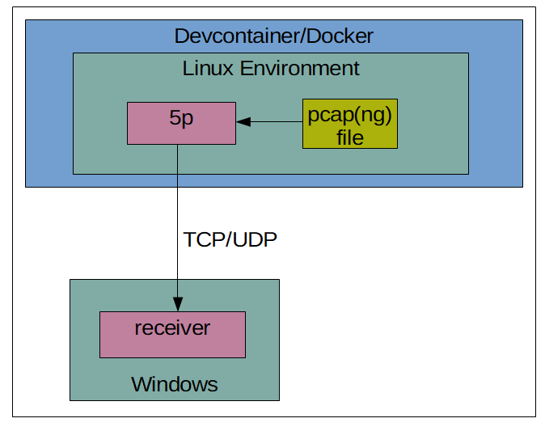

# **P**ca**PP**lus**P**lus**P**layer (5p)

Please be aware that this software is still in the construction phase. As such, it may contain bugs, incomplete features, and other issues.
Please proceed with caution.
This project is open-source, but it is your responsibility to verify and comply with any potential license issues.
We recommend thoroughly reviewing the licenses of any dependencies or third-party code used in this project.

## Table of Contents

- [About](#about)
- [Compiling](#compiling)
- [Quick Dive](#quick-dive)
- [ToDos](#todos)


---
<a name="about"></a>
## About

This software ''replays'' pcap(ng) files, i.e., reads their content and forwards the data via TCP or UDP packets.
The dependencies for the main functionality are pcapplusplus and boost.

1. On Windows, I am not aware of any suitable tools available for this task (especially with a free commercial license).
    On Linux, there is tcpreplay, which, however, did not work well with Boost sockets (at least for me).
    As far as I know, this issue is related to the different network layers on which the techniques operate.

    5p is supposed to read pcap(ng) files and forward the data via UDP/TCP for testing.

    However, there are some limitations for Windows usage:

    On Windows, the wcap.dll and packet.dll required by the pcapplusplus library (to run the program) are part of the npcap SDK and require a license for commercial usage.
    Compiling the software, however, does not require these dependencies.
    This repository contains a devcontainer (Linux) in which the software can be built and uses libpcap (BSD license).
    However, please note that a commercial license for Docker might be necessary.
    To clarify this issue, please refer to the following graphic which visualizes the data flow:

    


2. On Linux, you should be able to run the software without this limitation.

3. For Docker usage, please ensure there is enough memory for compilation tasks; >= 4GB is recommended.
If you compile natively on Windows, you might require the v142 toolset for Visual Studio (2019); otherwise, there might be unresolved symbol errors by the Boost library.

---
<a name="compiling"></a>
## Compiling

The project uses the Conan package manager (version 2): [Conan Documentation](https://docs.conan.io/2/tutorial.html). For the following steps, a Python 3 installation with pip is required.

### Install conan

```shell
python3 -m pip install conan
conan profile detect
```

If the latter commands do not succeed, some build tools (e.g., g++ on Linux and MSVC on Windows) might be missing.

### Compile 5p

By default the conan.io remote should be available:

```shell
conan remote list
```

should yield

conancenter: https://center.conan.io [Verify SSL: True, Enabled: True].

In the root directory of 5p now execute

```shell
conan install . --build=missing
conan build . --build=missing
```

The first command fetches all dependencies, and if they are not available, it tries to compile them. For this task, a CMake installation is required (check potential error logs).

**IMPORTANT NOTE** if you create a solution and compile it manually by using an IDE of your choice make sure to use "Release" build type as some dependencies might not be available as Debug build type.


---
<a name="quick-dive"></a>
## Quick Dive

After compilation you can run the program via (on Linux omit the .exe of course)

```
5p.exe C:\path\to\test\trace.pcapng
```

which reads the packets from the trace and forwards them via udp to 127.0.0.1:49999 (default).

This parameters can be adjusted via

```
5p.exe C:\path\to\test\trace.pcapng --ip 192.168.65.254 --port 40000
```

Note that for other ports you might need to forward that ports; cf. .devcontainer/devcontainer.json


For more details check
```
5p.exe --help
```


The ip address to receive the data on the host (Windows) you can extract via

```shell
ping host.docker.internal
```

which returns the ip address to use:

PING host.docker.internal (192.168.65.254) 56(84) bytes of data.

64 bytes from 192.168.65.254 (192.168.65.254): icmp_seq=1 ttl=63 time=1.38 ms

64 bytes from 192.168.65.254 (192.168.65.254): icmp_seq=2 ttl=63 time=0.491 ms
...


### Test Data flow

In the root directory’s scripts folder, there are basic scripts for testing the receiving and sending UDP/TCP packets.


---
<a name="todos"></a>
## ToDos

- Test usage on other setups (so far tested on Windows with Docker)
- Nicer graphics (I don’t do frontend ...)
- Add unit tests
